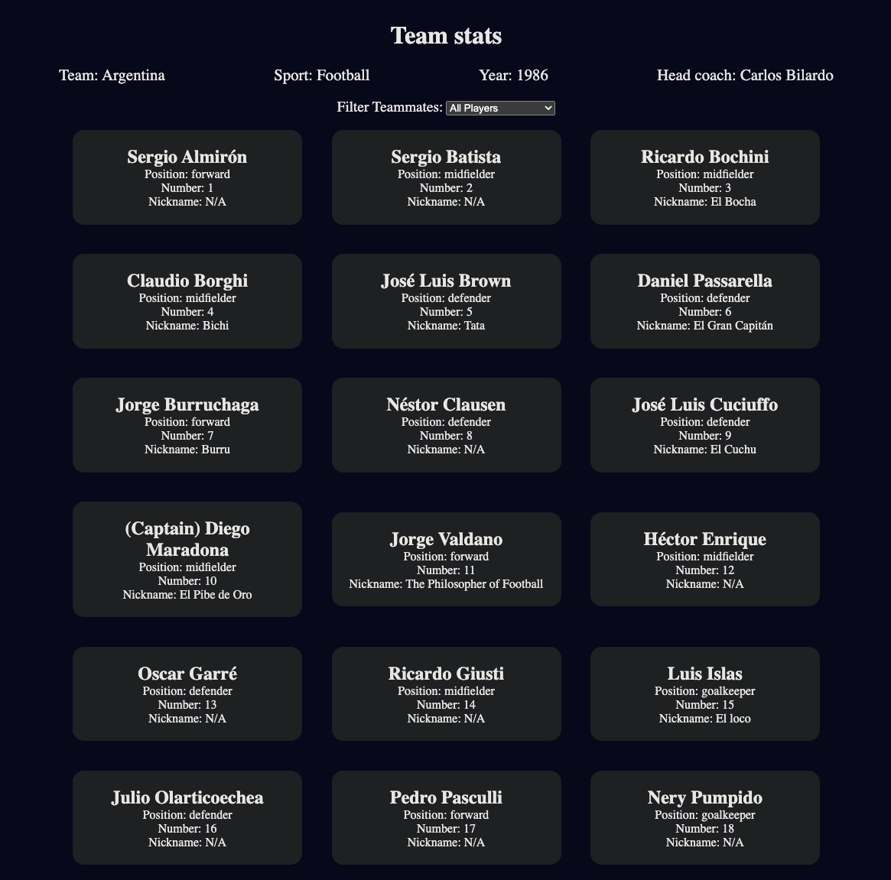

# Football Cards App

This is a project created as part of my journey to becoming a full stack developer through FreeCodeCamp. The Football Cards App demonstrates the process of processing datasets and outputting information to the screen using various web development concepts and techniques.

## Features

- **DOM Manipulation**: Learn how to manipulate the Document Object Model (DOM) to dynamically update the content of a web page.
- **Object Destructuring**: Understand how to destructure objects to extract specific properties and values efficiently.
- **Event Handling**: Implement event handling to respond to user interactions such as clicks or key presses.
- **Data Filtering**: Learn how to filter datasets based on specific criteria to display relevant information to users.

## Concepts Covered

This project covers a range of web development concepts and techniques, including:

- **Switch Statements**: Utilize switch statements to conditionally execute different blocks of code based on different cases.
- **Default Parameters**: Explore default parameters in function definitions to provide fallback values when arguments are not provided.
- **Object.freeze()**: Learn how to freeze objects to prevent modifications to their properties and values.
- **Array.map() Method**: Understand how to use the map() method to iterate over arrays and transform their elements into new arrays.

## Technologies Used

- HTML
- CSS
- JavaScript

