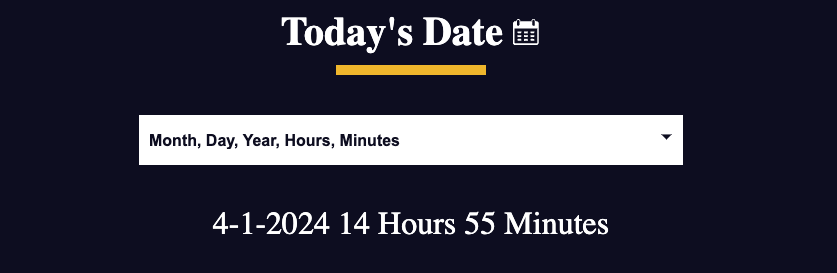

# Simple DateTime Display

This project is a web application that displays the current date and time in various formats. It was created as part of my full-stack development journey.

## Features

- Displays the current date and time in multiple formats:
  - yyyy-mm-dd
  - Year, week, day, hour, minute
  - dd-mm-yyyy
- Updates in real-time without needing to refresh the page.

## Motivation

I built this project to practice my skills in full-stack development and to provide a simple yet useful tool for displaying date and time information.

## Usage

To view the current date and time, simply open the `index.html` file in your web browser. You can select different date formats using the dropdown menu provided.

## Screenshots

## Technologies Used

- HTML
- CSS
- JavaScript

## License

This project is licensed under the [BSD 3-Clause License](LICENSE.md), as per the guidelines of FreeCodeCamp.

## Acknowledgements

This project was inspired by a FreeCodeCamp challenge.

